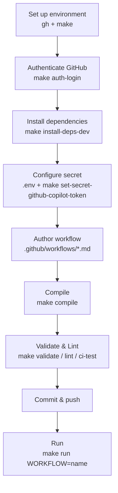

# Implementing Agentic Workflows (Windows / Linux / macOS)

This guide explains how to implement, validate, and run GitHub Agentic Workflows using the [`Makefile`](../Makefile) included in this repository.

All `Makefile` targets run on a Unix-like shell (bash). Once your environment is set up, **the `make` commands themselves are identical across all three operating systems**. The only per-OS difference is the one-time development environment setup.

> [!NOTE]
> The officially supported operating systems for GitHub Agentic Workflows are **Linux, macOS, and Windows (WSL)**. On Windows, work inside **WSL2 (Ubuntu)** rather than native PowerShell or Command Prompt. Inside WSL, the Linux steps in this guide apply as-is.

## Overview



## 1. Prerequisites

Before you begin, make sure you have:

- **An AI account**: GitHub Copilot (default engine), Anthropic Claude, OpenAI Codex, or Google Gemini. This template uses GitHub Copilot by default.
- **A GitHub repository with write access** (you are already using this repository).
- **GitHub Actions enabled** for the repository.
- **GitHub CLI (`gh`) v2.0.0 or later**. Check your version with `gh --version`.
- **`make`** available on your PATH (see the next section for installation).

## 2. Set Up the Development Environment (per OS, one-time)

Install the two tools `gh` and `make`. After that, you use the same `make` commands on every OS.

### Windows (WSL2)

1. Open PowerShell **as Administrator** and install WSL.

   ```powershell
   wsl --install
   ```

2. After restarting, launch the installed **Ubuntu** distribution.
3. From here on, run the "Linux (Debian / Ubuntu)" steps below inside the Ubuntu (WSL) terminal.

> [!IMPORTANT]
> The `Makefile` relies on Unix commands such as `grep`, `awk`, and `sed`, so it does not work in native Windows PowerShell or Command Prompt. Always run it inside WSL.

### Linux (Debian / Ubuntu)

```bash
sudo apt update
sudo apt install -y make gh
```

- If `gh` is outdated or unavailable via apt, follow the apt repository steps in the [official GitHub CLI installation guide](https://github.com/cli/cli#installation).
- On other distributions, install `make` (or `build-essential`) and `gh` with your package manager.

### macOS

Use [Homebrew](https://brew.sh/).

```bash
brew install gh make
```

- `make` is also included in the Xcode Command Line Tools. If it is not installed, you can get it with `xcode-select --install`.

### Verify installation (all OSes)

```bash
gh --version
make --version
```

List the available `make` targets with:

```bash
make help
```

## 3. Authenticate with GitHub

Sign in to the GitHub CLI with the `repo` and `workflow` scopes.

```bash
make auth-login
```

Internally, this runs the following (the scopes are defined by `GH_AUTH_SCOPES` in the `Makefile`):

```bash
gh auth login --scopes repo,workflow
```

Check your authentication status with:

```bash
gh auth status
```

## 4. Install Dependencies (the `gh-aw` extension)

Install the `github/gh-aw` CLI extension for GitHub Agentic Workflows.

```bash
make install-deps-dev
```

This target verifies that `gh` is present and runs `gh extension install github/gh-aw` only if the extension is not already installed.

## 5. Configure the Secret (`COPILOT_GITHUB_TOKEN`)

For the compiled workflow to use the Copilot engine on GitHub Actions, the repository secret `COPILOT_GITHUB_TOKEN` is required.

1. Create `.env` from the template (`.env` is not tracked by Git).

   ```bash
   cp .env.template .env
   ```

2. Edit `.env` and set a GitHub token (such as a PAT) that has access to GitHub Copilot.

   ```dotenv
   COPILOT_GITHUB_TOKEN=your_github_token_here
   ```

3. Register the value as a repository secret.

   ```bash
   make set-secret-github-copilot-token
   ```

   The `Makefile` automatically loads `.env` and internally runs:

   ```bash
   gh secret set COPILOT_GITHUB_TOKEN --body $COPILOT_GITHUB_TOKEN
   ```

> [!NOTE]
> The required secret depends on the AI engine you use (for example, `ANTHROPIC_API_KEY` for Claude, `OPENAI_API_KEY` for Codex, `GEMINI_API_KEY` for Gemini). See the [authentication reference](https://github.github.com/gh-aw/reference/auth/) for details.

## 6. Author an Agentic Workflow

Workflows are written as Markdown files (`*.md`) under `.github/workflows/`. Declare triggers, permissions, and safe outputs in the YAML frontmatter, and write instructions in natural language in the body.

Example: `.github/workflows/daily-repo-status.md`

```markdown
---
on:
  schedule: daily
permissions:
  contents: read
  issues: read
  pull-requests: read
safe-outputs:
  create-issue:
    title-prefix: "[team-status] "
    labels: [report, daily-status]
    close-older-issues: true
---

## Daily Repository Status Report

Create a daily repository status report for the team as a GitHub issue.

### What to include

- Recent repository activity (issues, PRs, discussions, releases, code changes)
- Progress tracking and highlights
- Project status and recommendations
- Actionable next steps for maintainers
```

> [!TIP]
> To scaffold a workflow interactively, you can also use `gh aw add-wizard <OWNER>/<REPO>/<WORKFLOW-NAME>`. See the [quickstart](https://docs.github.com/en/copilot/how-tos/github-agentic-workflows/quickstart) for details.

## 7. Compile, Validate, and Lint

### Compile

Compile Markdown workflows into `*.lock.yml` files that GitHub Actions can run.

```bash
make compile
```

Internally this runs `gh aw compile`, generating `.github/workflows/*.lock.yml` from `.github/workflows/*.md`. The generated `.lock.yml` files should be committed.

### Validate (non-destructive)

Validate the workflow definitions without generating lock files.

```bash
make validate
```

This is skipped when no `.github/workflows/*.md` files exist.

### Lint

Lint the compiled `.lock.yml` files with actionlint.

```bash
make lint
```

This is skipped when no `.lock.yml` files exist.

### Run everything (equivalent to CI)

Run dependency installation, info display, validation, and lint in one shot. CI ([`test.yaml`](../.github/workflows/test.yaml)) uses this same target.

```bash
make ci-test
```

## 8. Run a Workflow

After committing and pushing the generated `.lock.yml` files, you can trigger a workflow manually.

```bash
make run WORKFLOW=daily-repo-status
```

Set `WORKFLOW` to the workflow name (the file name in `.github/workflows/` without its extension). Internally this runs `gh aw run $(WORKFLOW)`.

## 9. `make` Target Reference

| Target | Description | Underlying command |
| --- | --- | --- |
| `make help` | List available targets | — |
| `make info` | Show Git revision / tag | — |
| `make install-deps-dev` | Install the `gh-aw` extension | `gh extension install github/gh-aw` |
| `make auth-login` | Authenticate the GitHub CLI | `gh auth login --scopes repo,workflow` |
| `make set-secret-github-copilot-token` | Set the `COPILOT_GITHUB_TOKEN` secret | `gh secret set COPILOT_GITHUB_TOKEN --body $COPILOT_GITHUB_TOKEN` |
| `make compile` | Compile `*.md` into `*.lock.yml` | `gh aw compile` |
| `make validate` | Validate workflow definitions (non-destructive) | `gh aw validate` |
| `make lint` | Lint `*.lock.yml` | `gh aw lint` |
| `make ci-test` | Full CI (deps + info + validate + lint) | The chain above |
| `make run WORKFLOW=<name>` | Run a workflow | `gh aw run <name>` |

## 10. Troubleshooting

| Symptom | Cause / Resolution |
| --- | --- |
| `make: command not found` | `make` is not installed. See Section 2 to install it. |
| `gh: command not found` | GitHub CLI is not installed. See Section 2 to install it. |
| `gh: unknown command "aw"` | The `gh-aw` extension is not installed. Run `make install-deps-dev`. |
| Authentication / permission errors | Re-run `make auth-login` and verify the scopes (`repo`, `workflow`) with `gh auth status`. |
| `Makefile` does not work on Windows | Run it inside **WSL (Ubuntu)**, not PowerShell or Command Prompt. |
| `validate` / `lint` is skipped | The target `*.md` / `*.lock.yml` files do not exist yet. Create them per Sections 6 and 7. |
| `set-secret-github-copilot-token` fails | Verify that `COPILOT_GITHUB_TOKEN` is set in `.env` and that you have permission to set repository secrets. |

## References

- [Your first agentic workflow (Quickstart)](https://docs.github.com/en/copilot/how-tos/github-agentic-workflows/quickstart)
- [GitHub Agentic Workflows documentation site](https://github.github.com/gh-aw/)
- [Authentication reference](https://github.github.com/gh-aw/reference/auth/)
- [GitHub CLI installation](https://github.com/cli/cli#installation)
