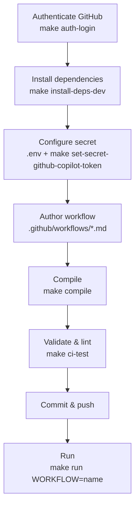

# はじめに

同梱の [`Makefile`](../../Makefile) を使って、GitHub Agentic Workflow を作成・検証・実行するための最小限の手順です。利用可能なすべてのターゲットを一覧するには `make help` を実行します。

> 開始する前に[前提条件](../../README.ja.md#前提条件)を完了してください。

## 概要



## 1. GitHub で認証する

```bash
make auth-login
```

## 2. 依存関係のインストール

```bash
make install-deps-dev
```

## 3. シークレットの設定

1. テンプレートから `.env` を作成します（`.env` は Git で追跡されません）。

   ```bash
   cp .env.template .env
   ```

2. GitHub Copilot にアクセスできる GitHub トークンを設定します。

   ```dotenv
   COPILOT_GITHUB_TOKEN=your_github_token_here
   ```

3. リポジトリのシークレットとして登録します。

   ```bash
   make set-secret-github-copilot-token
   ```

> [!NOTE]
> 必要なシークレットは AI エンジンによって異なります（例: Claude の場合は `ANTHROPIC_API_KEY`、Codex の場合は `OPENAI_API_KEY`、Gemini の場合は `GEMINI_API_KEY`）。[認証リファレンス](https://github.github.com/gh-aw/reference/auth/)を参照してください。

## 4. ワークフローの作成

ワークフローは `.github/workflows/` 配下の Markdown ファイル（`*.md`）です。YAML フロントマターでトリガー、権限、安全な出力（safe outputs）を宣言し、本文に自然言語で指示を記述します。

例: [.github/workflows/daily-repo-status.md](../../.github/workflows/daily-repo-status.md)

```markdown
---
on:
  schedule: daily
permissions:
  contents: read
  issues: read
  pull-requests: read
safe-outputs:
  create-issue:
    title-prefix: "[team-status] "
    labels: [report, daily-status]
    close-older-issues: true
---

## Daily Repository Status Report

Create a daily repository status report for the team as a GitHub issue.
```

> [!TIP]
> ワークフローを対話的にスキャフォールドするには、`gh aw add-wizard <OWNER>/<REPO>/<WORKFLOW-NAME>` を実行します。詳細は[クイックスタート](https://docs.github.com/en/copilot/how-tos/github-agentic-workflows/quickstart)を参照してください。

## 5. コンパイル

```bash
make compile
```

生成された `.github/workflows/*.lock.yml` ファイルをコミットします。

## 6. 検証とリント

```bash
make ci-test
```

## 7. コミット、プッシュ、実行

`*.md` ファイルと生成された `*.lock.yml` ファイルをコミットしてプッシュし、その後ワークフローを手動でトリガーします:

```bash
make run WORKFLOW=daily-repo-status
```

`WORKFLOW` には、ワークフローのファイル名（`.github/workflows/` 内）を拡張子なしで指定します。

## 参考リンク

- [はじめてのエージェントワークフロー（クイックスタート）](https://docs.github.com/en/copilot/how-tos/github-agentic-workflows/quickstart)
- [GitHub Agentic Workflows ドキュメントサイト](https://github.github.com/gh-aw/)
- [認証リファレンス](https://github.github.com/gh-aw/reference/auth/)
