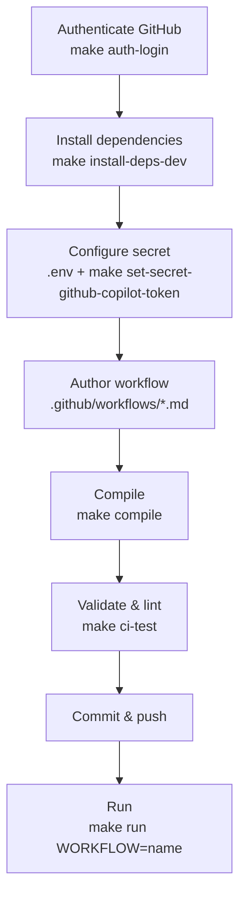

# Getting Started

Minimal steps to author, validate, and run a GitHub Agentic Workflow using the included [`Makefile`](../../Makefile). Run `make help` to list every available target.

> Complete the [prerequisites](../../README.md#prerequisites) before you start.

## Overview



## 1. Authenticate with GitHub

```bash
make auth-login
```

## 2. Install dependencies

```bash
make install-deps-dev
```

## 3. Configure the secret

1. Create `.env` from the template (`.env` is not tracked by Git).

   ```bash
   cp .env.template .env
   ```

2. Set a GitHub token with access to GitHub Copilot.

   ```dotenv
   COPILOT_GITHUB_TOKEN=your_github_token_here
   ```

3. Register it as a repository secret.

   ```bash
   make set-secret-github-copilot-token
   ```

> [!NOTE]
> The required secret depends on the AI engine (for example, `ANTHROPIC_API_KEY` for Claude, `OPENAI_API_KEY` for Codex, `GEMINI_API_KEY` for Gemini). See the [authentication reference](https://github.github.com/gh-aw/reference/auth/).

## 4. Author a workflow

Workflows are Markdown files (`*.md`) under `.github/workflows/`. Declare triggers, permissions, and safe outputs in the YAML frontmatter, and write instructions in natural language in the body.

Example: [.github/workflows/daily-repo-status.md](../../.github/workflows/daily-repo-status.md)

```markdown
---
on:
  schedule: daily
permissions:
  contents: read
  issues: read
  pull-requests: read
safe-outputs:
  create-issue:
    title-prefix: "[team-status] "
    labels: [report, daily-status]
    close-older-issues: true
---

## Daily Repository Status Report

Create a daily repository status report for the team as a GitHub issue.
```

> [!TIP]
> To scaffold a workflow interactively, run `gh aw add-wizard <OWNER>/<REPO>/<WORKFLOW-NAME>`. See the [quickstart](https://docs.github.com/en/copilot/how-tos/github-agentic-workflows/quickstart) for details.

## 5. Compile

```bash
make compile
```

Commit the generated `.github/workflows/*.lock.yml` files.

## 6. Validate and lint

```bash
make ci-test
```

## 7. Commit, push, and run

Commit and push your `*.md` and generated `*.lock.yml` files, then trigger a workflow manually:

```bash
make run WORKFLOW=daily-repo-status
```

Set `WORKFLOW` to the workflow's file name (in `.github/workflows/`) without its extension.

## References

- [Your first agentic workflow (Quickstart)](https://docs.github.com/en/copilot/how-tos/github-agentic-workflows/quickstart)
- [GitHub Agentic Workflows documentation site](https://github.github.com/gh-aw/)
- [Authentication reference](https://github.github.com/gh-aw/reference/auth/)
