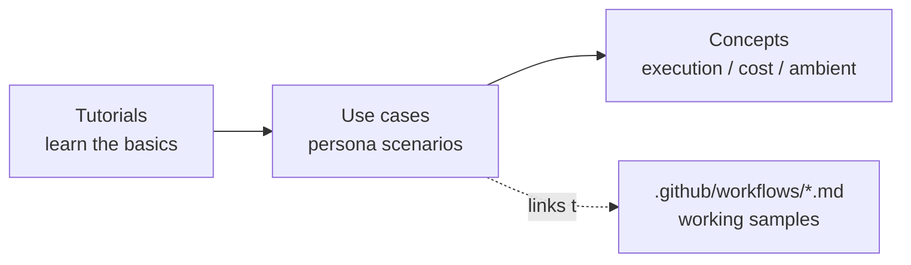

# ユースケース

GitHub Agentic Workflows (gh-aw) を実際の業務文脈で示す、ペルソナ別のシナリオ集です。まず[チュートリアル](../tutorials/01_getting-started.ja.md)で基礎を学び、その後ご自身の役割に最も近いペルソナを選んでください。

各シナリオは共通の[シナリオテンプレート](TEMPLATE.ja.md)に従い、[`.github/workflows/`](../../.github/workflows) 配下の **動作する** ワークフローにリンクしています。

## ドキュメントの関係

## ペルソナ

| ペルソナ | テーマ | シナリオ | 状態 |
| --- | --- | --- | --- |
| ① ソフトウェア開発者 | PR レビュー、Issue トリアージ、リリースノート | [PR レビュー補助](dev-productivity/pr-review-helper.ja.md) | ✅ 提供中 |
| ② IT インフラ運用者 | 障害トリアージ、ステータスレポート、依存更新 | [定期ステータスレポート](infra-ops/status-report.ja.md) | ✅ 提供中 |
| ③ 社内間接業務 (IssueOps) | 申請・承認フロー、ナレッジ Q&A | — | 🚧 準備中 |
| ④ 勤怠ルーチンワーク | リマインド、定例集計、締め処理通知 | — | 🚧 準備中 |

## シナリオの選び方

- すべてのプルリクエストに自動で一次レビューが欲しい → [PR レビュー補助](dev-productivity/pr-review-helper.ja.md)
- リポジトリの状態を定期的に要約してほしい → [定期ステータスレポート](infra-ops/status-report.ja.md)

## 関連コンセプト

- [実行アーキテクチャ: managed 実行環境・コスト・セキュリティ](../concepts/execution-architecture.ja.md)
- [ambient agent と Human-in-the-Loop: 簡易サーベイ](../concepts/ambient-agents-survey.ja.md)
- [ワークフローのフォーマットとコンパイルパイプライン](../concepts/compilation-and-format.ja.md)
- [外部連携: Azure・外部 API](../concepts/external-integrations.ja.md)
