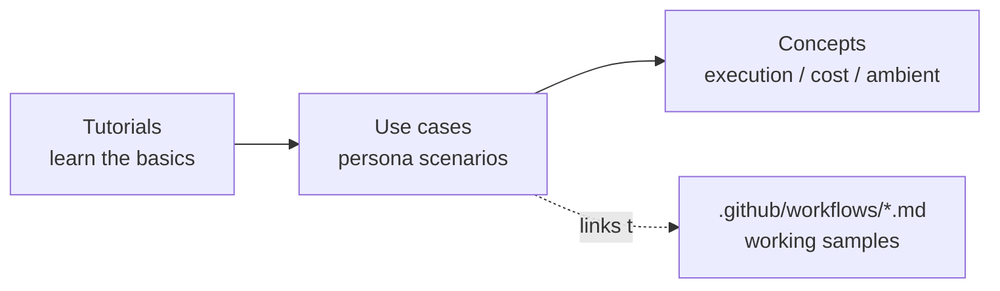

# Use cases

Persona-based scenarios that show GitHub Agentic Workflows (gh-aw) in a real work
context. Learn the basics in the [tutorials](../tutorials/01_getting-started.md)
first, then pick the persona closest to your role.

Each scenario follows a shared [scenario template](TEMPLATE.md) and links to a
**working** workflow under [`.github/workflows/`](../../.github/workflows).

## How the docs fit together

## Personas

| Persona | Theme | Scenario | Status |
| --- | --- | --- | --- |
| ① Software developer | PR review, issue triage, release notes | [PR review helper](dev-productivity/pr-review-helper.md) | ✅ Available |
| ② IT infra operator | Fault triage, status reports, dependency updates | [Periodic status report](infra-ops/status-report.md) | ✅ Available |
| ③ Back-office (IssueOps) | Request/approval flows, knowledge Q&A | — | 🚧 coming soon |
| ④ Attendance routine | Reminders, periodic aggregation, closing notices | — | 🚧 coming soon |

## Choosing a scenario

- Want automated first-pass feedback on every pull request? → [PR review helper](dev-productivity/pr-review-helper.md)
- Want a recurring health summary of a repository? → [Periodic status report](infra-ops/status-report.md)

## Related concepts

- [Execution architecture: managed runtime, cost, and security](../concepts/execution-architecture.md)
- [Ambient agents and Human-in-the-Loop: a short survey](../concepts/ambient-agents-survey.md)
- [Workflow format and the compile pipeline](../concepts/compilation-and-format.md)
- [External integrations: Azure and external APIs](../concepts/external-integrations.md)
